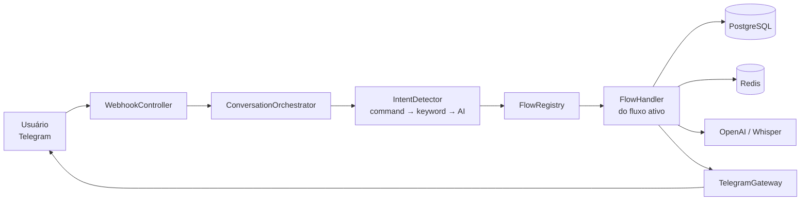

# FitJourneyAI

**Assistente de acompanhamento físico com IA no Telegram.**
Trabalho de Conclusão de Curso — Ciência da Computação, PUC Goiás.


---

## O que é

O FitJourneyAI é um chatbot de Telegram que acompanha a jornada física de uma pessoa ao longo do tempo: registra peso e medidas, confirma treinos realizados, gera treinos personalizados com IA, monta gráficos de progresso e produz resumos inteligentes — tudo por conversa natural, sem app dedicado.

O projeto foi inicialmente planejado para o WhatsApp, mas migrou para a **Telegram Bot API** devido às restrições da WhatsApp Cloud API para este tipo de uso.

## Funcionalidades

| Fluxo | Descrição |
|---|---|
| **Onboarding** | Contextualização inicial: objetivo, nível, persona e intensidade motivacional |
| **Check-in corporal** | Registro rápido de peso e registro guiado de medidas corporais |
| **Registro de atividade** | Confirmação multimodal de treinos realizados |
| **Geração de treino** | Treinos personalizados gerados por IA a partir do perfil e do histórico |
| **Progresso** | Gráficos de evolução renderizados no servidor e enviados como imagem |
| **Resumos** | Sínteses inteligentes do período |
| **Conversa contextual** | Diálogo livre com memória de contexto |
| **Configuração** | Ajuste de persona e intensidade motivacional a qualquer momento |
| **Entrada por áudio** | Transcrição de mensagens de voz via **Whisper** |
| **Nudge de inatividade** | Scheduler que reengaja usuários parados |

## Arquitetura

Organizado em **Clean Architecture**, com o domínio isolado de frameworks e integrações. A seleção de fluxo de conversa usa **Strategy Pattern** (`FlowHandler` + `FlowRegistry`), o que permite adicionar um novo fluxo sem tocar no orquestrador.

```
src/main/java/br/edu/puc/fitjourneyai
├── adapter/                    # Entradas e saídas (drivers)
│   ├── telegram/               # WebhookController, TelegramGateway, DTOs
│   └── openai/                 # OpenAiGateway, WhisperGateway
├── core/                       # Domínio — sem dependência de framework
│   ├── orchestrator/           # ConversationOrchestrator, FlowRegistry
│   ├── flow/                   # Um handler por fluxo (Strategy)
│   │   ├── onboarding/  navigation/  checkin/  activity/
│   │   └── workout/  progress/  summary/  config/  conversation/
│   ├── intent/                 # Command → Keyword → AI (cadeia de detecção)
│   ├── model/                  # entities, enums, value objects
│   ├── port/                   # Interfaces de repositório e gateway
│   └── ai/                     # AiService, PersonaPromptBuilder
├── infrastructure/             # Implementações concretas
│   ├── ai/  chart/  persistence/  scheduling/
│   └── ConversationCacheService.java
└── config/                     # HttpClient, Redis, OpenAI, Telegram
```

**Detecção de intenção em cadeia:** comando explícito (`/treino`) → palavra-chave → classificação por IA. Só chega à IA o que os dois primeiros não resolveram, o que reduz custo e latência.

**Estado da conversa** fica em PostgreSQL (fonte de verdade) com cache em Redis, permitindo fluxos de múltiplos passos sem perder contexto entre mensagens.



## Stack

- **Java** · **Spring Boot** · Maven
- **PostgreSQL** com migrations **Flyway** (V1–V8)
- **Redis** para cache de estado conversacional
- **OpenAI** para geração de treinos, resumos e conversa; **Whisper** para áudio
- **n8n** para automações complementares (`n8n/fitjourneyai-n8n-workflows.json`)
- **Docker** e **Docker Compose** para execução local e deploy

## Qualidade

Mais de **30 classes de teste** cobrindo orquestrador, registry, todos os handlers de fluxo, detectores de intenção, gateways (Telegram, OpenAI, Whisper), serviço de gráficos, cache, scheduler e configurações.

```bash
./mvnw test
```

## Como executar

**Pré-requisitos:** Docker e Docker Compose, um bot criado no [@BotFather](https://t.me/BotFather) e uma chave da OpenAI.

```bash
git clone https://github.com/Igorpcferreira/fitjourneyai.git
cd fitjourneyai
cp .env.example .env      # preencha TELEGRAM_BOT_TOKEN e OPENAI_API_KEY
docker compose up -d
```

O Flyway aplica as migrations automaticamente na subida. Para desenvolvimento sem container:

```bash
./mvnw spring-boot:run
```

> O Telegram exige HTTPS para webhooks. Em desenvolvimento local, exponha a aplicação com um túnel (ngrok, Cloudflare Tunnel) e registre a URL no webhook do bot.

## Documentação

O diretório `docs/` reúne o material de TCC e o desenho do sistema:

- `docs v1/architecture/` — diagramas C4 (contexto, contêiner, componentes) e diagrama de sequência
- `docs v1/fluxos/` — especificação escrita de cada fluxo de conversa
- `docs v2/fluxos/diagramas tcc/` — diagramas finais, incluindo o modelo entidade-relacionamento e a arquitetura de implantação
- `docs v1/tcc/` — relatórios de andamento e evidências de execução

---

<sub>Autor: **Igor de Castro** · [igordecastro.com.br](https://www.igordecastro.com.br) · [LinkedIn](https://www.linkedin.com/in/igor-cferreira)</sub>
